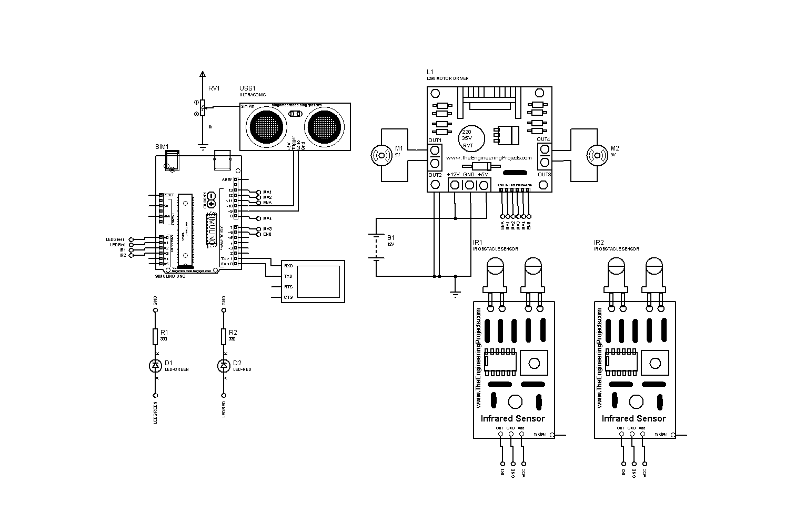

# Esquema de Conexiones

## Diagrama General

## Conexiones al Arduino Nano

| Componente | Pin Arduino | Función |
|------------|-------------|---------|
| Sensor de seguimiento | A3 | Señal digital |
| Sensor de seguimiento | A2 | Señal digital |
| Ultrasonido - Trigger | D3 | Salida para iniciar medición |
| Ultrasonido - Echo | D4 | Entrada para recibir tiempo |
| Servo Cabezal | D9 | Control PWM |
| Servo Brazo | D10 | Control PWM |
| L298N - ENA | D5 | PWM motor izquierdo |
| L298N - IN1 | D6 | Dirección motor izquierdo |
| L298N - IN2 | D7 | Dirección motor izquierdo |
| L298N - ENB | D11 | PWM motor derecho |
| L298N - IN3 | D12 | Dirección motor derecho |
| L298N - IN4 | D13 | Dirección motor derecho |
| LED Verde | A0 | Indicador avance |
| LED Rojo | A1 | Indicador obstáculo |

## Conexiones del L298N

| Pin L298N | Conexión |
|-----------|----------|
| OUT1, OUT2 | Motor izquierdo |
| OUT3, OUT4 | Motor derecho |
| +12V | Batería positivo |
| GND | Batería negativo y GND Arduino |
| 5V | 5V Arduino (si se usa puente) |

## Notas Importantes

- Asegúrate de conectar las tierras (GND) del Arduino y del L298N.
- Los LEDs deben conectarse con sus respectivas resistencias (220 ohm) a GND.
- El sensor ultrasónico requiere alimentación de 5V.